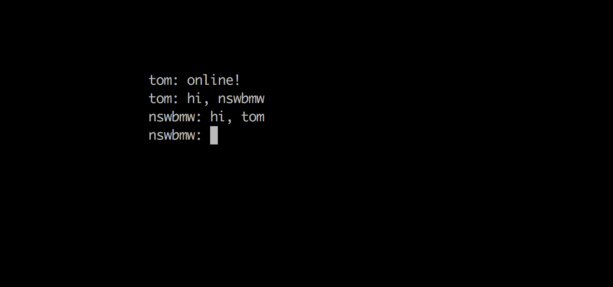

## cli-chat

cli chat. Try it out ~



**Note**: v3 use `tcp`, v4 use `udp`.

### Install

```sh
$ npm i cli-chat -g
```

### Usage

```sh
$ cli-chat
```

Options:

```sh
  Usage: cli-chat [options]


  Options:

    --port <port>              udp port, default: 1234
    --subnetMask <subnetMask>  subnetMask, default: '255.255.255.0'
    --username <username>      username, default use current user
    --indent <indent>          indent, default: 20 space
    -h, --help                 output usage information
```

### License

MIT